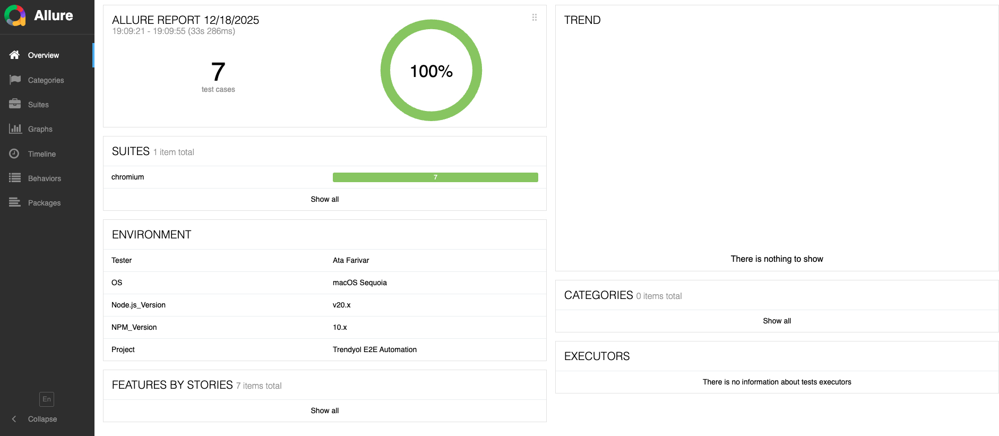
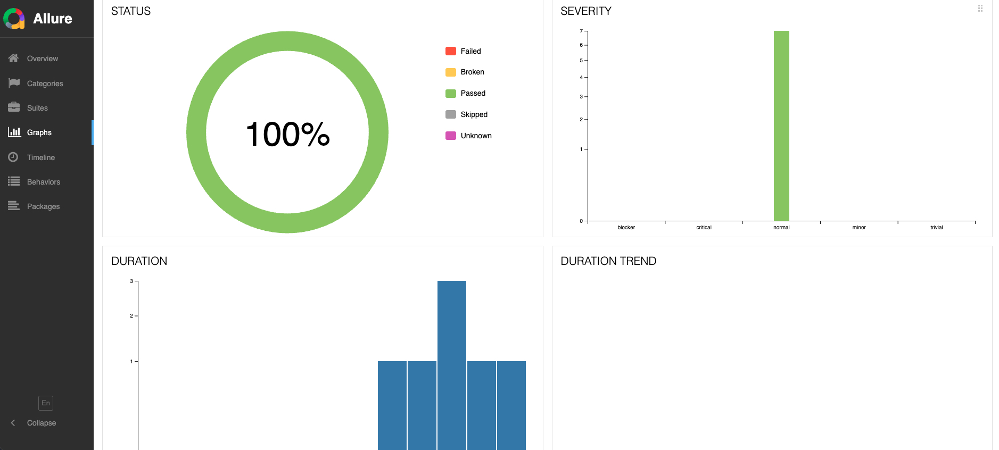

# 🛡️ Advanced Playwright Automation Framework (Trendyol E2E)




This repository demonstrates a professional-grade E2E test automation framework built with **Playwright** and **TypeScript**. The architecture follows the "Gold Standard" by utilizing **Page Object Model (POM)** combined with **Custom Fixtures** for maximum scalability and clean code.

## 🚀 Key Features

- **Fixture-based Architecture:** Leveraging Playwright Fixtures for dependency injection, eliminating the need for manual page object instantiation in every test.
- **Self-Cleaning Reports:** Integrated Node.js logic to automatically wipe old `allure-results` and `playwright-report` folders before each run.
- **BDD-Style Reporting:** Using `test.step` to create human-readable execution steps visible in Allure and HTML reports.
- **Environment Security:** Secure credential management using `dotenv` to keep sensitive data out of the source code.
- **Rich Debugging:** Configured to capture **Video**, **Screenshots**, and **Traces** on test failures.
- **Multi-Browser Ready:** Pre-configured for Chromium, Firefox, and Webkit.

## 🛠️ Tech Stack

- **Engine:** [Playwright](https://playwright.dev/)
- **Language:** TypeScript
- **Pattern:** Page Object Model (POM) & Custom Fixtures
- **Reporting:** Allure Framework & Playwright HTML Report
- **Security:** Dotenv (.env)

## 📂 Project Structure

```text
├── fixtures/           # Dependency injection (BaseTest.ts)
├── models/             # Centralized locators (LoginPageLocators.ts)
├── pages/              # Logic & Action methods (LoginPage.ts)
├── tests/              # Test scenarios (login.spec.ts)
├── .env                # Local environment variables (Hidden from Git)
├── Credentials.ts      # Test data mapping from process.env
└── playwright.config.ts# Global framework & reporting configuration
```

## 🏁 Getting Started

### 1. Prerequisites

Node.js (v18+)

Allure Commandline (for viewing Allure reports)

### 2. Installation

```bash
git clone https://github.com/AtaFarivar/playwright-e2e-real-project.git
cd playwright-e2e-real-project
npm install
npx playwright install
```

### 3. Setup Credentials

Create a .env file in the root directory and add your Trendyol account details:

```plaintext
TRENDYOL_EMAIL=your_email@example.com
TRENDYOL_PASSWORD=your_password
```

### 4. Running Tests

Run all login scenarios:

```bash
npx playwright test --grep @login
```

### 5. Generating Reports

To view the visual Allure dashboard:

```bash
npx allure serve allure-results
```

Author: Ata Farivar
